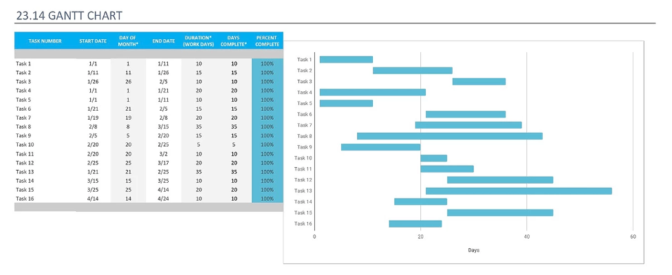
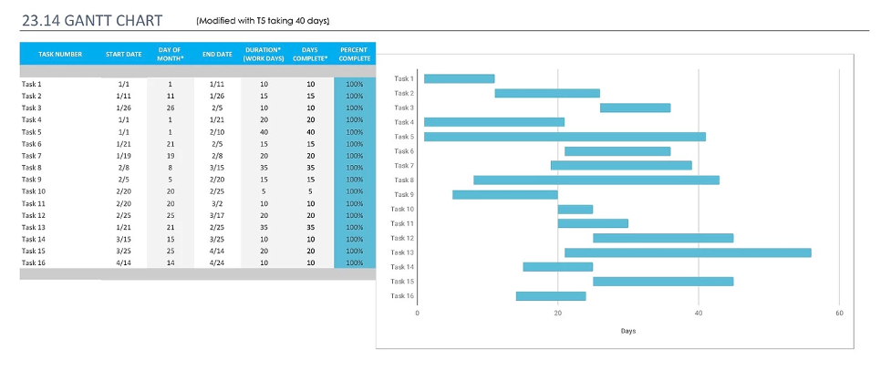

Ex 23.6
Q: Figure 23.14 shows the task duration for software project activities. Assume that a serious, unanticipated setback occurs, and instead of taking 10 days, task T5 takes 40 day. Draw up new bar charts showing how the project might be reorganized.

A: 

 
Chart without modification

 

Since the next task (T10) that depended on T5 also depended on T9 which ended after 40+ days, nothing else was effected.

